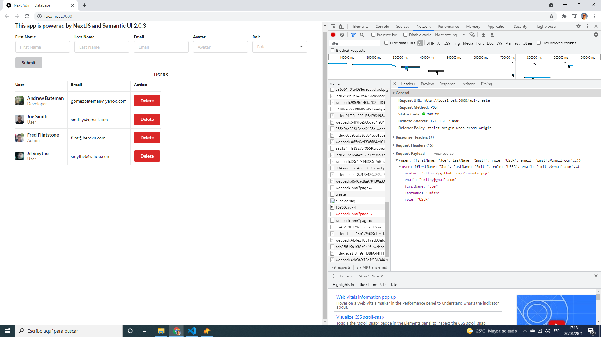

# :zap: Next Prisma Postgres

* A Full-stack app using a Next.js + Semantic UI frontend with a Prisma ORM and Docker Postgres instance database backend
* Code from CodingAndCaffeine with modifications - see :clap: Inspiration below
* **Note:** to open web links in a new window use: _ctrl+click on link_


## :page_facing_up: Table of contents

* [:zap: Next API Data](#zap-next-api-data)
  * [:page_facing_up: Table of contents](#page_facing_up-table-of-contents)
  * [:books: General Info](#books-general-info)
  * [:camera: Screenshots](#camera-screenshots)
  * [:signal_strength: Technologies](#signal_strength-technologies)
  * [:floppy_disk: Setup](#floppy_disk-setup)
  * [:computer: Code Examples](#computer-code-examples)
  * [:clipboard: Status & To-Do List](#clipboard-status--to-do-list)
  * [:clap: Inspiration](#clap-inspiration)
  * [:file_folder: License](#file_folder-license)
  * [:envelope: Contact](#envelope-contact)

## :books: General Info

* User enters their data in a Semantic UI table: names, email etc.
* User data stored in a postgres database.
* Postgres instance started using docker-compose YAML file
* Prisma used for Node.js and Typescript Object Relational Mapping (ORM) for the PostgreSQL database
* Next.js used for frontend is for server-rendered react apps. It has automatic code splitting, simple page-based routing, built-in CSS support and hot reloading. Every component file in the pages folder is treated as a page

## :camera: Screenshots

.

## :signal_strength: Technologies

* [Node.js v14](https://nodejs.org/) javascript runtime using the [Chrome V8 engine](https://v8.dev/).
* [React v17](https://reactjs.org/) Javascript library.
* [Next v11](https://nextjs.org/) minimalist framework for rendering react apps on the server.
* [Semantic UI React v2](https://react.semantic-ui.com/) React version of [Semantic User Interface](https://semantic-ui.com/)
* [Docker Engine - Community v20](https://hub.docker.com/) for Windows
* [Docker Compose](https://docs.docker.com/compose/) used to define and run a container using a YAML Docker file
* [Windows Subsystem for Linux Installation Guide for Windows 10](https://docs.microsoft.com/en-gb/windows/wsl/install-win10) - note: this will not work on Windows 10 Home as it does not have Hyper-V. There are ways to get round this with virtual terminals etc. but I never got them to work. This project was done on Windows Pro.
* [Prisma v2](https://www.prisma.io/)
* [Prisma CLI v2](https://www.prisma.io/docs/concepts/components/prisma-cli/installation)
* [TablePlus for Windows](https://tableplus.com/windows) database management

## :floppy_disk: Setup

* `npm run dev` runs the app in the development mode. Open [http://localhost:3000](http://localhost:3000) to view it in the browser.
* `npm run build` builds the app for production to the `build` folder. It correctly bundles React in production mode and optimizes the build for the best performance. The build is minified and the filenames include the hashes.

## :computer: Code Examples

* `create.ts` to save user data using Prisma

```tsx
  import { NextApiRequest, NextApiResponse } from "next"
import prisma from "../../lib/prisma";

const userResponse = async (req: NextApiRequest, res: NextApiResponse) => {
  if (req.method !== 'POST') {
    return res.status(405).json({
      message: 'Only POST method allowed'
    });
  }

  try {
    const { user } = req.body;
    const savedUser = await prisma.user.create({
      data: user
    });
    res.status(200).json(savedUser);
  } catch (error) {
    res.status(400).json({ 
      message: 'An error occured',
      error: error
   })
  }
}

export default userResponse;
```

## :clipboard: Status & To-Do List

* Status: Working
* To-Do: Nothing

## :clap: Inspiration

* [CodingAndCaffeine: Getting started with Prisma, Next.js & Postgres | FullStack Application](https://www.youtube.com/watch?v=2rslnyHksqg)

## :file_folder: License

* N/A

## :envelope: Contact

* Repo created by [ABateman](https://github.com/AndrewJBateman), email: gomezbateman@yahoo.com